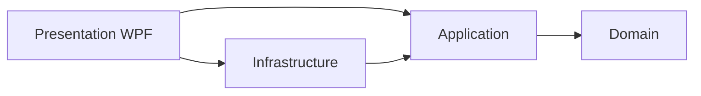

# Visão Arquitetural

## Estilo

Clean Architecture pragmática, organizada internamente por feature.

A seta `UI → Infrastructure` representa composição/DI no bootstrap, não acesso direto das Views.

## Camadas

### Domain
Modelos, regras puras, value objects e políticas sem dependências externas.

### Application
Casos de uso, portas, validação e orquestração.

### Infrastructure
Firebird, SQLite, tooling, credenciais, filesystem, logging e notificações.

### Presentation
WPF, ViewModels, Design System, navegação e estados visuais.

## Princípios

- SRP e boundaries claros.
- Imutabilidade em snapshots/eventos.
- Funções puras em parsing, normalização e diagnóstico quando possível.
- Efeitos colaterais nas bordas.
- DI para dependências externas.
- Interfaces apenas quando possuem valor arquitetural/testável.
