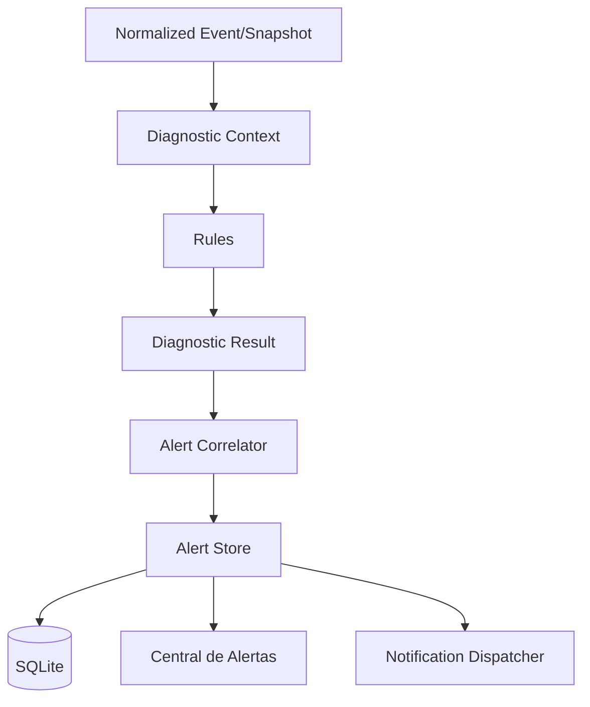

# Diagnóstico e Alertas

## Pipeline



## Regras

- determinísticas;
- configuráveis;
- presets Conservador/Normal/Agressivo/Personalizado;
- evidências estruturadas;
- sem dependência de WPF.

## Ciclo de vida

```text
Active → Acknowledged → Resolved
```

Reconhecimento não significa resolução.

## Deduplicação

Identidade lógica aproximada:

```text
RuleId + DatabaseSession + TargetType + TargetId
```

Preservar `FirstSeen`, `LastSeen` e `Occurrences`.

## Notificações

`INotificationChannel` permite:

- in-app;
- Windows no primeiro release;
- e-mail/webhook/Teams futuramente.

Cooldown impede spam.
