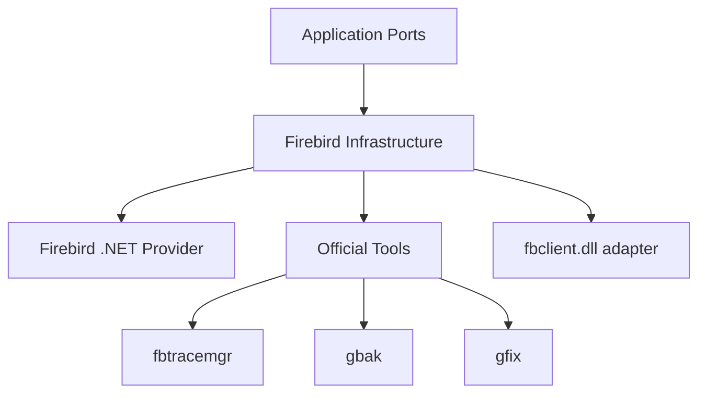

# Integração Firebird e Multi-versão

## Abordagem híbrida



Prioridade:

1. Provider .NET.
2. Tooling oficial.
3. API nativa apenas quando necessária.

## Estratégia de versão

A Application não deve perguntar `if version >= 4`.

```text
FirebirdProvider
├── Capabilities
├── MonitoringQueryStrategy
├── TraceStrategy
├── MetadataStrategy
└── MaintenanceStrategy
```

## Toolset Discovery

- descoberta automática;
- versão das ferramentas;
- política de compatibilidade;
- fallback manual;
- toolset efetivo visível antes de operações sensíveis.

## Regra

Não criar uma implementação inteira por versão se somente uma consulta ou recurso diferir. Compartilhar comportamento comum e especializar apenas o delta.
