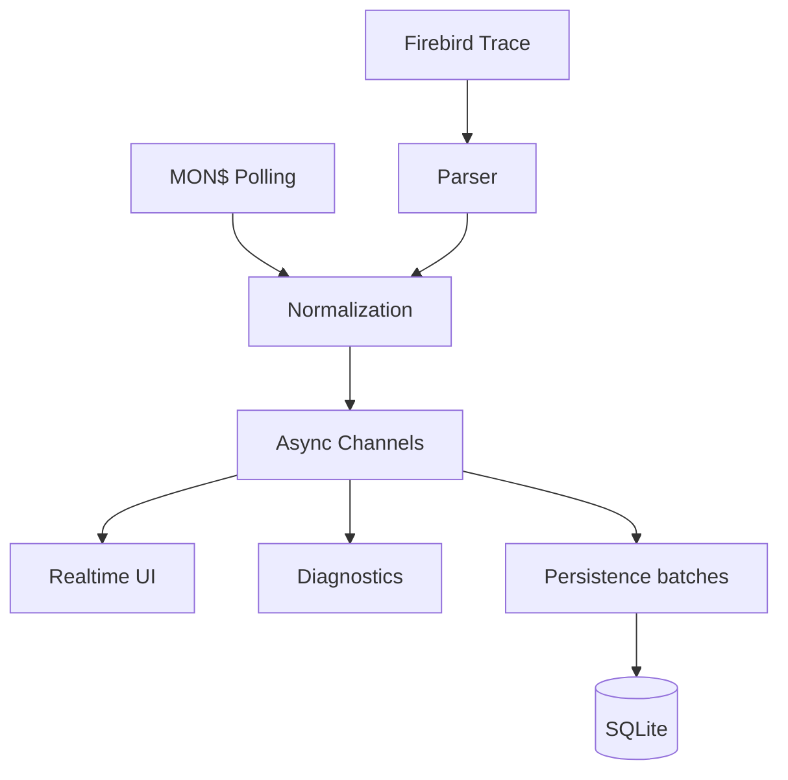

# Monitoring e Profiler

## Pipeline



## Polling

Modo configurável + adaptativo.

| Preset | Faixa proposta |
|---|---|
| Agressivo | 250 ms–2 s |
| Normal | 500 ms–5 s |
| Conservador | 1–10 s |
| Personalizado | Configurável |

## Profiler

Captura e visualização são independentes.

```text
Capture → Normalize → Persist
                 └──→ UI Buffer → Batch → Grid
```

### Prioridade sob carga

1. Captura
2. Persistência
3. Diagnóstico
4. Visualização

A UI pode reduzir frequência de atualização sem interromper Trace.

## Follow / Inspect

- Follow: acompanha o evento recente.
- Inspect: seleção e scroll ficam fixos.
- Novos eventos continuam chegando.
- Retorno ao tempo real é explícito.
